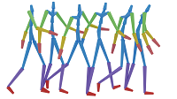


  You can also find my articles on <u><a href="{{author.googlescholar}}">my Google Scholar profile</a>.</u>





  


# 📝 Publications 

Under Review

[Contrastive disentanglement for self-supervised motion style transfer]
**Zizhao Wu**, Siyuan Mao, Cheng Zhang, Yigang Wang, Ming Zeng

[**Paper**](https://)  \| [**Code**](https:///)

