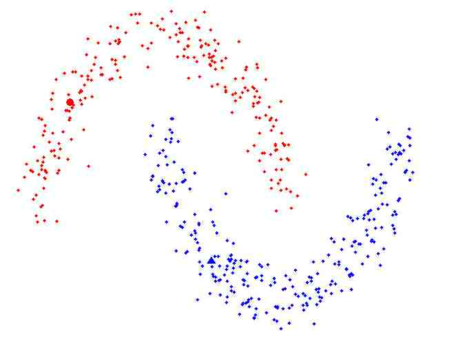

<!--

  You can also find my articles on <u><a href="{{author.googlescholar}}">my Google Scholar profile</a>.</u>





  

-->

<!-- # 📝 Publications -->

2024

[Contrastive disentanglement for self-supervised motion style transfer]()

**Zizhao Wu**, Siyuan Mao, Cheng Zhang, Yigang Wang, Ming Zeng

[**Paper**](https://)  \| [**Code**](https:///)

2023

[PU-GAT: Point Cloud Upsampling with Graph Attention Network](https://www.sciencedirect.com/science/article/pii/S1524070323000310)

Xuan Deng, Cheng Zhang, Jian Shi, **Zizhao Wu**

[**Paper**](https://www.sciencedirect.com/science/article/pii/S1524070323000310)  \| [**Code**](https:///)

2023

[Trajectory-Aware Body Interaction Transformer for Multi-Person Pose Forecasting](research/tbiformer.pdf)

Xiaogang Peng, Siyuan Mao, **Zizhao Wu**

[**Paper**](research/tbiformer.pdf)  \| [**Code**](https://github.com/xiaogangpeng/TBIFormer)

2023

[Structure-Aware Subspace Clustering](research/subspace.pdf)

Kou, Simin; Yin, Xuesong; wang, yigang; Chen, Songcan; Chen, Tieming, **Zizhao Wu**

[**Paper**](research/subspace.pdf)  \| [**Code**](https://)

2023

[CMCNet: A Patch-wise Contrastive Memory-augmented Few-Shot Colorization Network](research/cmcnet.pdf)

Xiaying Liu, Ping Yang, Alexandru Telea, Jiri Kosinka, **Zizhao Wu**

[**Paper**](research/cmcnet.pdf)  \| [**Code**](https://)

2023

[Position‐Aware spatio‐temporal Graph Convolutional Networks for Skeleton‐based Action Recognition](https://ietresearch.onlinelibrary.wiley.com/doi/full/10.1049/cvi2.12223)

Ping Yang, Qing Wang, Hao Cheng, **Zizhao Wu**

[**Paper**](https://ietresearch.onlinelibrary.wiley.com/doi/full/10.1049/cvi2.12223)  \| [**Code**](https://)

2023

[StyleBERT: Text-Audio Sentiment Analysis with Bi-directional Style Enhancement](https://www.sciencedirect.com/science/article/abs/pii/S0306437922001259)

Fei Lin, Shengqiang Liu, Cong Zhang, Jin Fan, **Zizhao Wu**

[**Paper**](https://www.sciencedirect.com/science/article/abs/pii/S0306437922001259)  \| [**Code**](https://)

2023

[USTNet: Unsupervised Shape-to-Shape Translation via Disentangled Representations](research/ustnet.pdf)

Fei Lin, Shengqiang Liu, Cong Zhang, Jin Fan, **Zizhao Wu**

[**Paper**](research/ustnet.pdf)  \| [**Code**](https://haoran226.github.io/USTNet)

2023

[Point-Voxel Transformer: An Efficient Approach To 3D Deep Learning](https://arxiv.org/abs/2108.06076)

Cheng Zhang, Haocheng Wan, Shengqiang Liu, Xinyi Shen, **Zizhao Wu**

[**Paper**](https://arxiv.org/abs/2108.06076)  \| [**Code**](https://github.com/HaochengWan/PVT)

2023

[PatchFormer: A Versatile 3D Transformer Based on Patch Attention.](https://arxiv.org/abs/2108.06076)

Cheng Zhang, Haocheng Wan, Xinyi Shen, **Zizhao Wu**

[**Paper**](https://arxiv.org/abs/2111.00207)  \| [**Code**](https://github.com/HaochengWan/PVT)

2023

[Graph-PBN: Graph-based Parallel Branch Network for Efficient Point Cloud Learning.](https://arxiv.org/abs/2108.06076)

Cheng Zhang, Hao Chen, Haocheng Wan, Ping Yang, **Zizhao Wu**

[**Paper**](https://www.sciencedirect.com/science/article/abs/pii/S1524070321000254)  \| [**Code**](https://github.com/HaochengWan/PVT)

2023

[Controllable Facial Caricaturization with Localized Deformation and Personalized Semantic Attentions.](https://arxiv.org/abs/2108.06076)

Ming Zeng; Yinglin Zheng; Jinpeng Lin; Xuan Cheng; Jing Liao; **Zizhao Wu**; Wenjin Deng

[**Paper**](https://ieeexplore.ieee.org/document/9535294)  \| [**Code**]()

2020

[Co-skeletons: Consistent Curve Skeletons for Shape Families.](research/skeleton.pdf)

**Zizhao Wu**, Xingyu Chen, Lingyun Yu, Alexandru Telea, Jiri Kosinka

[**Paper**](research/skeleton.pdf)  \| [**Code**]()

2020

[Multi-Human Parsing with Pose and Boundary Guidance.](research/humanparsing20.pdf)

ShunChen Du, Yigang Wang, **Zizhao Wu**

[**Paper**](research/humanparsing20.pdf)  \| [**Code**]()

2020

[V3D-LSFM:Video-based Human 3D Pose Estimation with Long-term and Short-term Pose Fusion Mechanism](research/pose20.pdf)

Wenjin Deng, Yinglin Zheng, Hui Li, Xianwei Wang,  **Zizhao Wu**, Ming Zeng 

[**Paper**](research/pose20.pdf)  \| [**Code**]()

2019

[Efficient L0 resampling of point sets](https://https://doi.org/10.1016/j.cagd.2019.101790)

Xuan Cheng, Ming Zeng, Jinpeng Lin, **Zizhao Wu**, Xinguo Liu

[**Paper**](https://https://doi.org/10.1016/j.cagd.2019.101790)  \| [**Code**]()

2019

[Dual attention based fine-grained leukocyte recognition for imbalanced microscopic images.](https://doi.org/10.3233/JIFS-191000)

Qinghao Yea, Daijian Tu, Feiwei Qin, **Zizhao Wu**, Yong Peng and Shuying Shen

[**Paper**](https://doi.org/10.3233/JIFS-191000)  \| [**Code**]()

2019

[Active Co-Segmentation of collections of 3D Shapes with Graph Convolutinal Networks..](https://doi.org/10.1109/MCG.2019.2891634)

**Zizhao Wu**, Ming Zeng, Feiwei Qin, Yigang Wang, Jiří Kosinka

[**Paper**](https://doi.org/10.1109/MCG.2019.2891634)  \| [**Code**]()

2018

[Joint analysis of shapes and images via deep domain adaptation.](https://doi.org/10.1016/j.cag.2017.07.013)

**Zizhao Wu**, Yunhui Zhang, Ming Zeng, Feiwei Qin, Yigang Wang

[**Paper**](https://doi.org/10.1016/j.cag.2017.07.013)  \| [**Code**]()

2018

[Fine-grained leukocyte classification with deep residual learning for microscopic images.](https://doi.org/10.1016/j.cmpb.2018.05.024)

Feiwei Qin, Nannan Gao, Yong Peng, **Zizhao Wu**, Shuying Shen, Artur Grudtsin

[**Paper**](https://doi.org/10.1016/j.cmpb.2018.05.024)  \| [**Code**]()

2018

[Integrated Modeling, Simulation, and Visualization for Nanomaterials](https://doi.org/10.1155/2018/5083247)

Feiwei Qin, Haibin Xia, Yong Peng, **Zizhao Wu**

[**Paper**](https://doi.org/10.1016/j.cmpb.2018.05.024)  \| [**Code**]()

2018

[Interactive shape co-segmentation via label propagation](https://doi.org/10.1016/j.cag.2013.11.009)

**Zizhao Wu**, Ruyang Shou, Yunhai Wang, Xinguo Liu

[**Paper**](https://doi.org/10.1016/j.cag.2013.11.009)  \| [**Code**]()

2018

[Unsupervised co-segmentation of 3D shapes via affinity aggregation spectral clustering.](https://doi.org/10.1016/j.cag.2013.05.015)

**Zizhao Wu**, Yunhai Wang, Ruyang Shou, Baoquan Chen, Xinguo Liu

[**Paper**](https://doi.org/10.1016/j.cag.2013.05.015)  \| [**Code**]()

